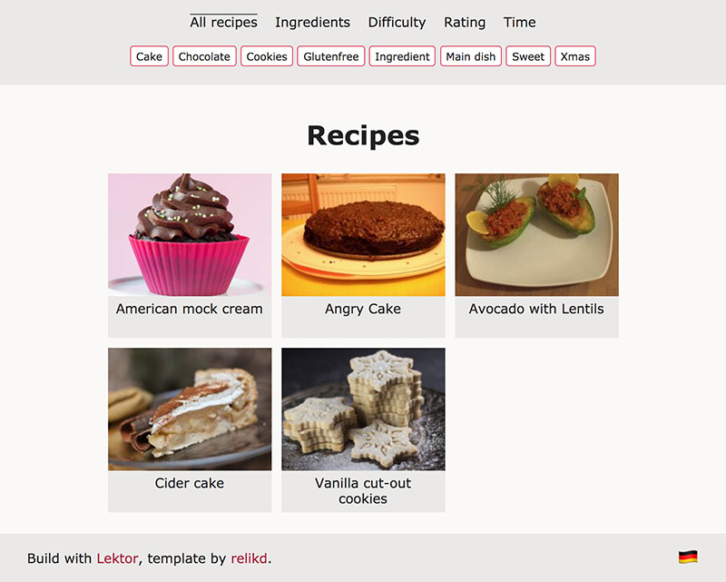
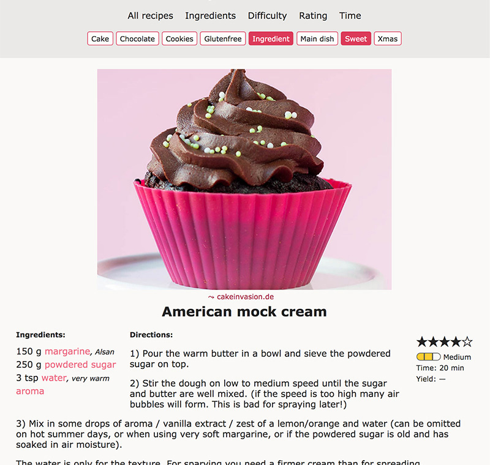
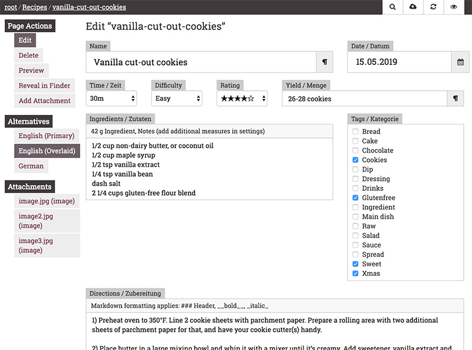

Lektor recipes
==============

Static site generator for recipes; built upon [Lektor](https://github.com/lektor/lektor/).

Features
-------

- Responsive design (desktop, mobile, print)
- Mobile Web-Application
- Multi-language (DE & EN, more can be added)
- Blazing fast due to minimal data usage
- Indexed (group by time, ingredients, or tags)
- PDF export (if LuaLaTex is installed)
- ~~static search~~ (**not yet**, but coming soon…)

Install
-------

1. Download [Lektor](https://www.getlektor.com/) and follow the instructions.

2. Clone this repository and change to the root directory.

3. Run `make dev server` to run a local server and preview the page.

4. For distribution run `make build pdf deploy` and add an [official deploy](https://www.getlektor.com/docs/deployment/).

### Modify

Thanks to Lektor you have a simple content management system (see screenshot below).
A few things to note:

1. Measurements have to be added manually to settings. Don't forget to __pluralize__ (c, cup, cups, etc.)

2. You can add __ingredient groups__ if the line ends with a colon (`:`)

3. The preferred __image size__ is `800x600`. Please scale all images down to save bandwidth. Try to keep an aspect ratio of 4:3 for the first image, or it will be cropped on the recipe overview page! All other images will be shown unmodified in whatever aspect ratio is provided (individual recipe page)

Also, see [Lektor docs](https://www.getlektor.com/docs/) and [jinja2 template](https://jinja.palletsprojects.com/en/2.10.x/templates/) documentation.

